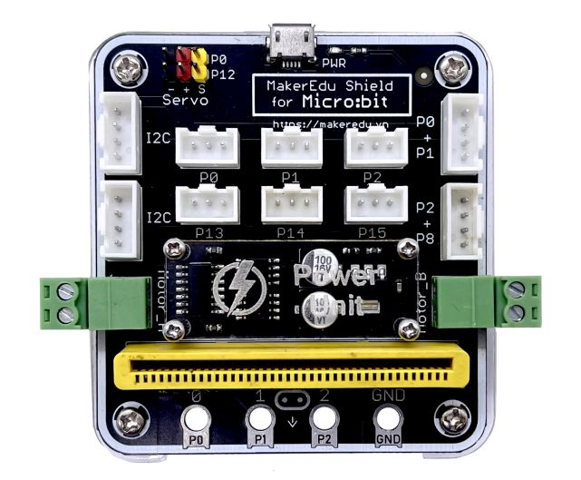
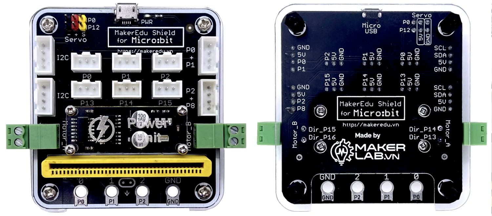
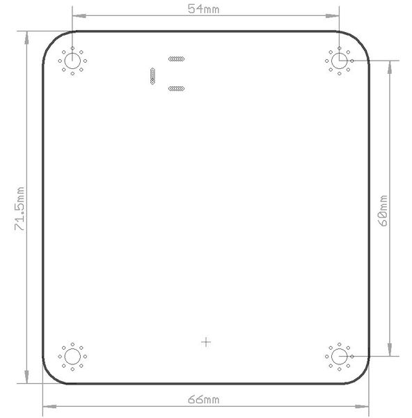
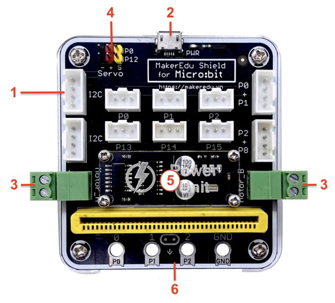
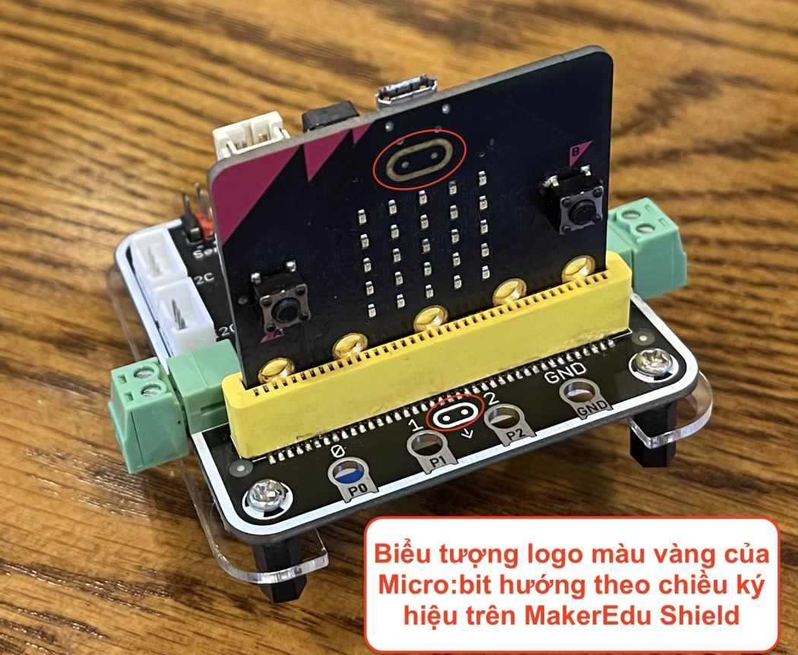
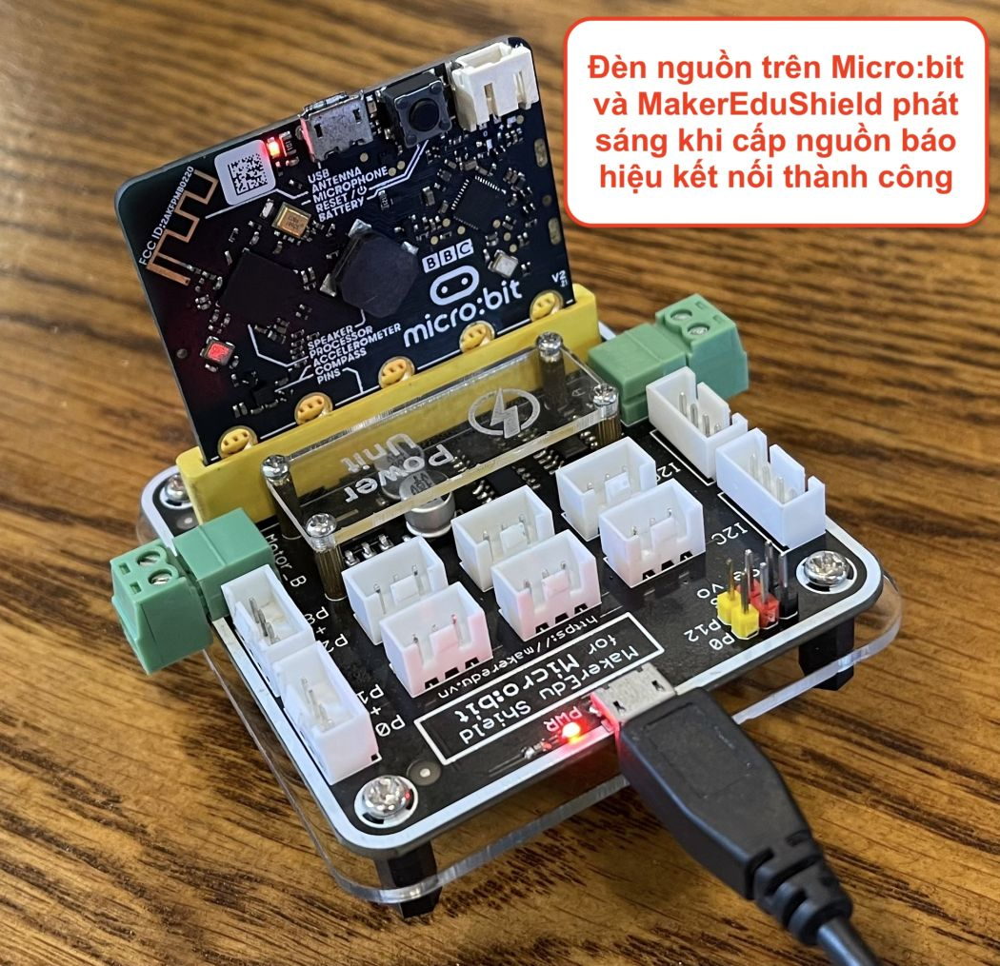

# Mạch MakerEdu Shield for Micro:bit

## Giới thiệu

Mạch MakerEdu Shield for Micro:bit là một bo mạch trung gian giúp bạn kết nối Micro:bit với các mạch trong hệ sinh thái phần cứng Robotics MakerEdu. Sau khi đã kết nối, Micro:bit sẽ trở thành mạch điều khiển trung tâm trong hệ sinh thái phần cứng Robotics MakerEdu với 3 chức năng chính:

1. Chức năng lưu trữ và thực thi các lệnh lập trình qua khối điều kiển là mạch Micro:bit (Controller Unit).
2. Chức năng cấp nguồn, giao tiếp và điều khiển các mạch module chức năng MakerEdu Module, cảm biến MakerEdu Sensor qua các cổng kết nối chuẩn XH2.54.
3. Chức năng điều khiển 2 Động cơ DC, 2 Động cơ RC Servo qua Khối Công Suất (Power Unit) trên mạch MakerEdu Shield for Micro:bit.
Mạch MakerEdu Shield for Micro:bit được thiết kế để có thể tương thích tốt nhất với phiên bản Micro:bit V2 và các phiên bản có thiết kế tương tự.

## Thông số kỹ thuật

<table><thead>
  <tr>
    <th>Model</th>
    <th>MakerEdu Shield for Micro:bit</th>
  </tr></thead>
<tbody>
  <tr>
    <td>Tương thích</td>
    <td>Tương thích tốt nhất với Micro:bit V2 hoặc các phiên bản có thiết kế tương tự.</td>
  </tr>
  <tr>
    <td>Chuẩn Connector kết nối</td>
    <td>XH2.54 3Pins / 4Pins</td>
  </tr>
  <tr>
    <td>Nguồn đầu vào</td>
    <td>5VDC từ cổng Micro USB trên mạch.</td>
  </tr>
  <tr>
    <td>Cổng Digital I/O đơn</td>
    <td>6 cổng: [P0], [P1], [P2], [P13], [P14], [P15]</td>
  </tr>
  <tr>
    <td>Cổng Digital I/O đôi</td>
    <td>2 cổng: [P0+P1], [P2+P8]</td>
  </tr>
  <tr>
    <td>Cổng Analog Input</td>
    <td>2 cổng: [P0], [P1], [P2]</td>
  </tr>
  <tr>
    <td>Cổng giao tiếp I2C</td>
    <td>2 cổng: [I2C]</td>
  </tr>
  <tr>
    <td>Cổng điều khiển RC Servo</td>
    <td>2 cổng: [P0], [P12]</td>
  </tr>
  <tr>
    <td>Cổng điều khiển động cơ DC</td>
    <td>2 cổng: [Motor_A], [Motor_B]</td>
  </tr>
  <tr>
    <td>Cổng kết nối mở rộng (kẹp cá sấu, jack bắp chuối)</td>
    <td>4 cổng: [P0], [P1], [P2], [GND]</td>
  </tr>
</tbody></table>

## Hình ảnh sản phẩm

## Kích thước sản phẩm

## Hướng dẫn sử dụng

### Các tính năng vượt trội

1. Mạch MakerEdu Shield for Micro:bit là một bo mạch trung gian giúp bạn kết nối Micro:bit với các mạch trong hệ sinh thái phần cứng Robotics MakerEdu với chuẩn kết nối connector XH2.54 chắc chắn, chống ngược và dễ dàng tháo lắp khi sử dụng với các mạch module chức năng MakerEdu Module và cảm biến MakerEdu Sensor.
2. Cấp nguồn qua cổng MicroUSB dễ dàng và an toàn, có thể sử dụng pin dự phòng (Power Bank), nguồn sạc điện thoại hoặc nguồn từ cổng USB máy tính để cấp nguồn cho mạch MakerEdu Shield for Micro:bit
3. Tích hợp cổng điều khiển 2 x Động cơ RC Servo.
4. Tích hợp cổng điều khiển 2 x Động cơ DC.
5. Vỏ Mica bảo vệ an toàn, tránh chập chạm.
6. Tích hợp các cổng kết nối mở rộng tương tự như Micro:bit dùng cho các ứng dụng cảm ứng chạm hoặc kết nối đơn giản.

### Các lưu ý

#### 1) Cấp nguồn

Các bạn bắt buộc phải cấp nguồn qua cổng MicroUSB của MakerEdu shield vì nguồn trên các cổng kết nối, động cơ và Micro:bit đều được lấy từ cổng này, khi đó nguồn chính của hệ thống sẽ là 5VDC, các bạn có thể lựa chọn cấp nguồn từ cổng USB của máy tính, các loại nguồn cấp bằng cổng USB hoặc với các ứng dụng di động như robot có thể cấp nguồn bằng sạc dự phòng, loại sạc dự phòng khuyến nghị sử dụng:

- [Pin dự phòng USB-C 5VDC 2A 5000mAh Mini Power Bank](https://hshop.vn/pin-du-phong-usb-c-5vdc-2a-5000mah-mini-power-bank)

#### 2) Động cơ DC

Động cơ DC sử dụng phải là loại có thể hoạt động ở điện áp 5VDC, với dòng điện tiêu thụ tối đa 800mA, các loại động cơ khuyến nghị sử dụng:

- [Động cơ DC giảm tốc V1 Dual Shaft Plastic Geared TT Motor + bánh xe](https://hshop.vn/dong-co-dc-giamtoc-v1-1-48)
- [Bộ động cơ DC giảm tốc GA12 N20 kèm gá bắt và bánh xe V1 34mm](https://hshop.vn/bo-dong-co-dc-giam-toc-ga12-n20-kem-ga-bat-va-banh-xe-v1-34mm)
- [Động cơ bơm chìm Mini Water Pump 5VDC](https://hshop.vn/dong-co-bom-chim-mini-5vdc) (lưu ý với động cơ bơm cần phải cấp đúng chiều + và - không sẽ làm hỏng cấu trúc động cơ).

#### 3) Động cơ RC Servo

Động cơ RC Servo sử dụng phải là loại có thể hoạt động ở điện áp 5VDC, động cơ RC Servo sử dụng trực tiếp nguồn từ cổng MicroUSB của MakerEdu Shield nên khi sử dụng cần cấp nguồn với dòng điện đủ để động cơ có thể hoạt động bình thường, động cơ khuyến nghị sử dụng:

- [Động cơ RC Servo 9G](https://hshop.vn/dong-co-rc-servo-9g)
- [Động cơ RC Servo MG90S](https://hshop.vn/dong-co-rc-servo-mg90s)

### Cách kết nối

Sau khi kết nối thành công, cấp nguồn vào cổng MicroUSB của MakerEdu Shield sẽ thấy đèn nguồn trên Micro:bit và MakerEdu Shield sáng như hình:

## Hướng dẫn sử dụng phần mềm MakeCode với mạch Micro:bit + MakerEdu Shield for Micro:bit

1) Giới thiệu về mạch Micro:bit và phần mềm MakeCode

2) Giới thiệu và hướng dẫn sử dụng mạch MakerEdu Shield for Micro:bit

3) Cách kết nối và nạp chương trình cho mạch Micro:bit trên máy tính với phần mềm MakeCode

4) Cách kết nối và nạp chương trình cho mạch Micro:bit trên điện thoại, máy tính bảng với phần mềm MakeCode

5) Cách cài đặt Extension và giới thiệu các khối lệnh cho phần cứng MakerEdu trên phần mềm MakeCode

## Hỗ trợ và liên hệ

- Website: [https://www.makerlab.vn/](https://www.makerlab.vn/)
- Facebook: [https://www.facebook.com/makerlabvn](https://www.facebook.com/makerlabvn)

## Nhà phân phối

- Các bạn có thể mua sản phẩm của MakerLab tại các [Nhà Phân Phối.](https://www.makerlab.vn/distributor/)
